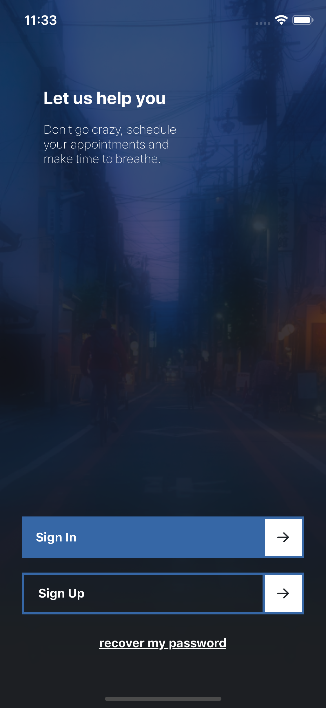
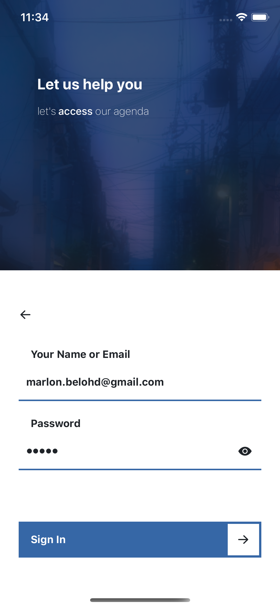
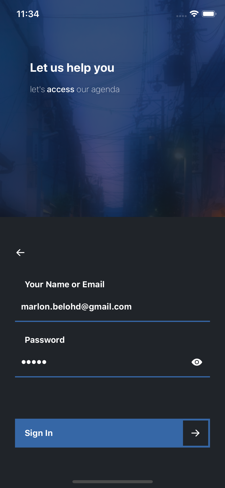
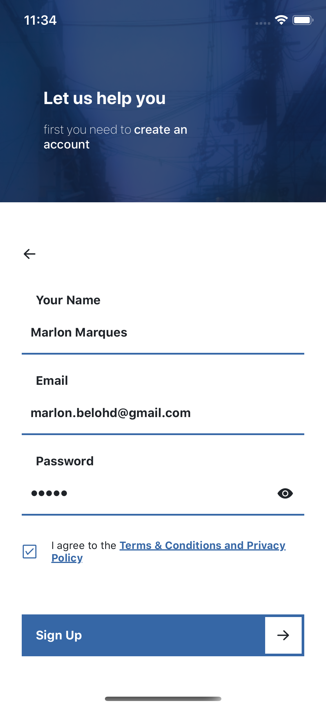
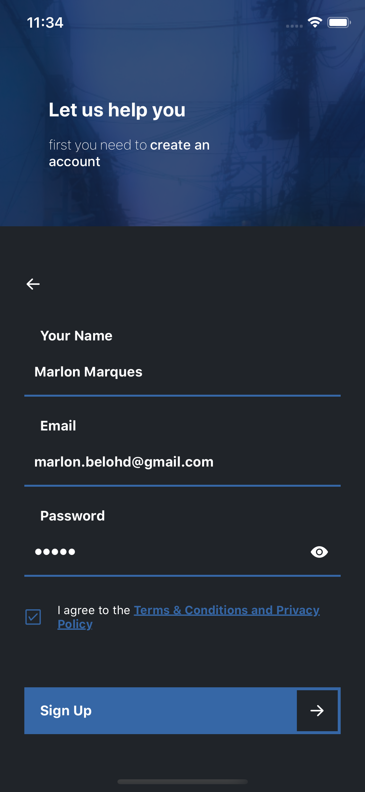
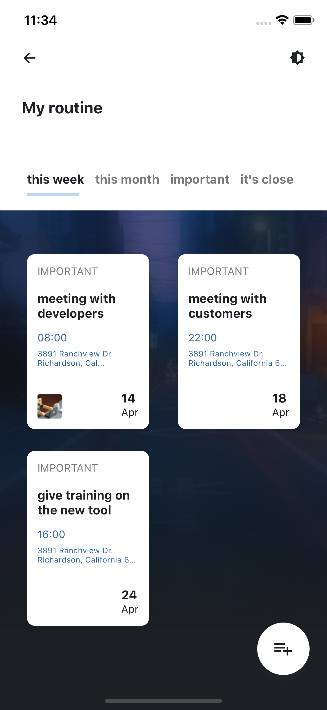
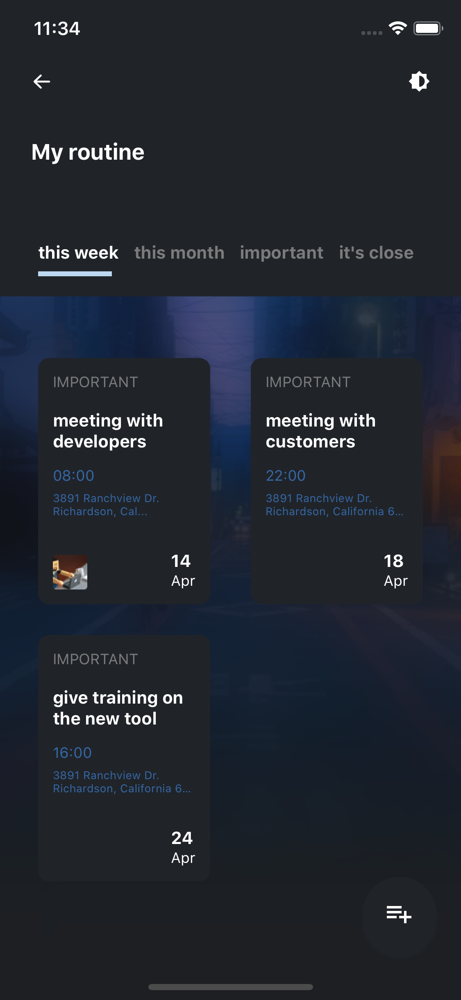
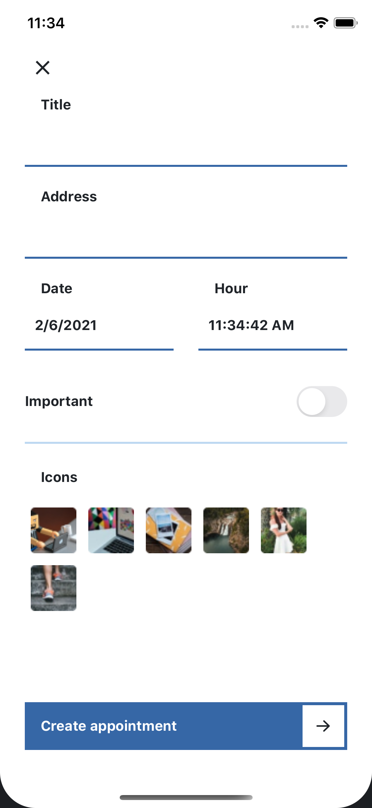
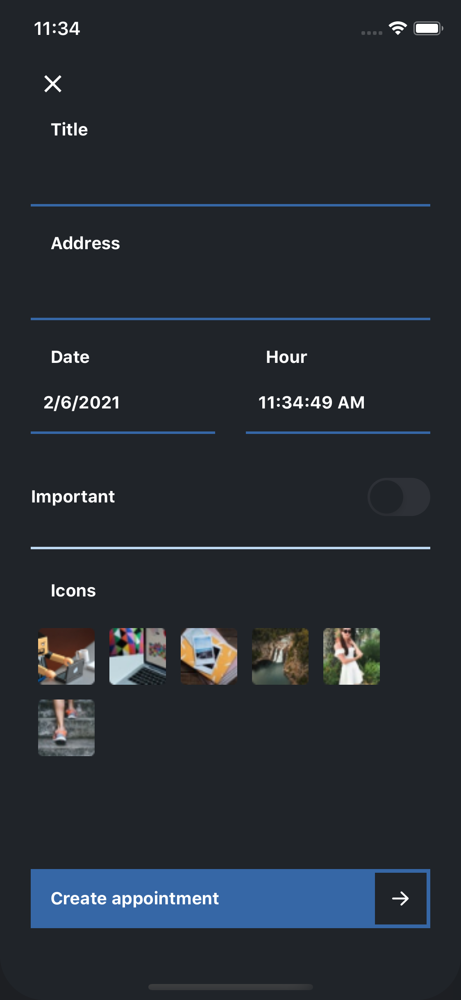

# My Routine

<p align="center">
My routine, is an application where you can create your commitments and flitrals as important.</p>

<p align="center">
  <a href="https://github.com/MarlonBeloMarques">
    
  </a>
</p>


<p align="center">
    
    
    
    
    
    
    
    
    
    
</p>

---

| Project | Preview | Screens | Estimation | Status |
| ------ | :------: | :------: | :------: | :------: |
| [My routine](https://www.figma.com/file/EoLb8vsdj0kGauabO1T3iI/interfacestemplates-my-routine?node-id=0%3A1) |  | 5 | ~4 days | :white_check_mark: |

---

## 🚀 Starting

### Prerequisites


- To run any React Native / Expo application, you need to configure the environment on your machine.

- Defining the environment is a complex process, so I recommend following the Expo documentation:

#### [**Expo Introduction**](https://expo.io/learn)


### Clone

- Clone this repository on your machine

```
https://github.com/MarlonBeloMarques/myroutine-react-native
```
### Getting Started

- `$ yarn install`
- `$ yarn start`

## 📌 Support

Please contact me at one of the following places!

- Instagram on [@marlomarquesbr](https://www.instagram.com/marlonmarqsbr/)
- Linkedin on [Marlon Marques](https://www.linkedin.com/in/marlon-marques-0b509813b/)
